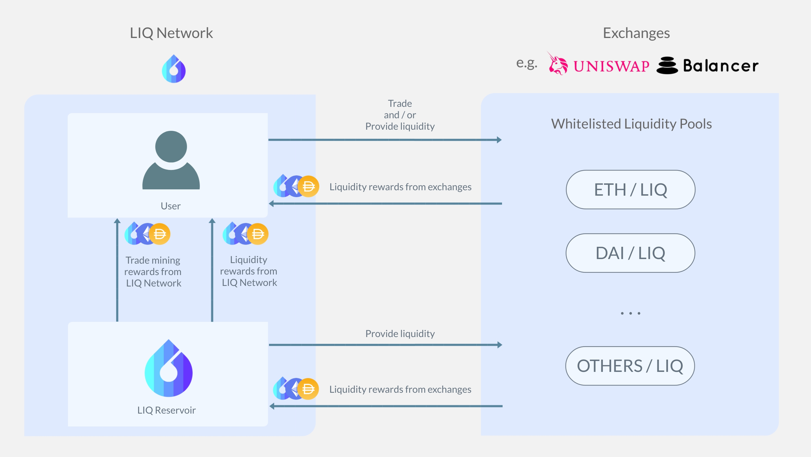

# Introduction

## LIQ Network

LIQ Network is a decentralized liquidity provider network.

LIQ network provides market liquidity to Ethereum based tokens. This is achieved by providing incentives for holders of LIQ to trade on decentralized exchanges (e.g. Uniswap). Additionally, a substantial part of LIQ supply will be put into liquidity pools to further elevate the DeFi market.

